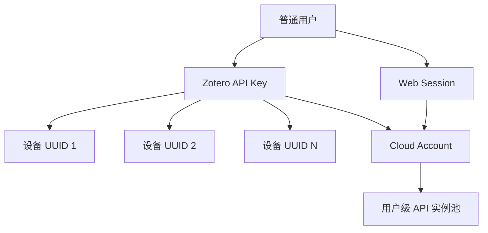

<p align="center">
  
</p>

<h1 align="center">Zotero Full Translate</h1>

<p align="center">
  面向 Zotero 的全文 PDF 翻译方案：Zotero 负责阅读与任务操作，Cloud 负责账户、翻译 API 实例池、任务调度、译文资产与跨设备复用。
</p>

<p align="center">
  
  
  
  
</p>

<p align="center">
  
  
  
  
</p>

---

## 项目简介

Zotero Full Translate 将全文 PDF 翻译拆分为两个明确的组件：

- **Zotero 插件**：提交全文翻译、显示任务进度、恢复任务、自动导入译文、原文/译文对照阅读、联动滚动、查看 API 剩余额度与低额度警告。
- **Cloud 服务**：账户认证、Zotero API Key、用户级翻译 API 实例池、任务队列、额度/QPS/健康状态、DOI 译文绑定、译文版本、结果下载与管理后台。

核心目标不是在 Zotero 本地堆叠多个翻译 SDK，而是让 Zotero 保持轻量，把翻译服务、账号、额度和调度统一放在 Cloud 管理。

## 功能概览

| 模块 | 能力 |
| --- | --- |
| 全文翻译 | 从 Zotero Reader 一键提交 PDF 全文翻译任务 |
| 实时任务 | 显示解析、翻译、排版、生成等阶段与总体进度 |
| 自动导入 | 任务完成后下载译文 PDF 并挂载回 Zotero |
| 对照阅读 | 原文 / 译文并排阅读，并支持联动滚动 |
| API 实例池 | 每一张 API 卡片都是独立实例，同一厂商可添加多个账号 |
| 调度 | 支持单实例、负载均衡、主备切换等策略 |
| API 动态同步 | Zotero 从 Cloud 动态获取当前账户已启用、已配置的 API 实例 |
| 额度管理 | Zotero 设置页显示实例级剩余额度；低额度时 Reader 菜单显示警告 |
| DOI 译文复用 | 按 DOI 与翻译参数锁定当前译本，支持跨设备复用 |
| 强制重译 | 新译本成功前保留旧译本，完成后再原子切换当前版本 |
| 多设备 | 一个账户 API Key 可供多台 Zotero 客户端使用 |
| 管理后台 | 独立 `3006` 端口用于用户、统计与系统状态管理 |

## 多账号、同一翻译源

Cloud 按“**API 实例**”而不是“厂商类型”管理翻译服务。

例如，同一个账户可以同时配置：

```text
百度论文账号
百度备用账号
阿里云专业版 A
阿里云专业版 B
OpenAI Compatible - 内网模型
OpenAI Compatible - 公网模型
```

这些实例拥有各自独立的：

- 实例名称
- API 凭据
- QPS / 并发
- 字符额度
- 今日用量
- 健康状态
- 低额度阈值
- 调度参与状态

因此多个同源账号可以真正用于额度拆分、负载均衡或主备，而不会被合并成一个“百度”或“阿里云”选项。

## 已内置翻译 API 模板

当前 Cloud 目录包含：

| 厂商 / 类型 | 模板 |
| --- | --- |
| 百度 | 通用文本翻译、大模型文本翻译、领域文本翻译 |
| 腾讯 | TMT、TokenHub、混元 |
| 火山引擎 | 机器翻译 |
| 阿里云 | 机器翻译通用版、机器翻译专业版 |
| OpenAI 协议 | OpenAI Compatible 自定义实例 |

阿里云专业版支持按场景配置；百度领域文本翻译支持按领域配置。所有实例均由各自账户独立保存与调度。

## Zotero 端体验

### Reader 菜单

Reader 中的操作按功能分组：

- **翻译**：翻译全文、重新翻译
- **任务**：查看/恢复 Cloud 任务、打开用户中心
- **阅读**：原文/译文对照、联动滚动

插件会在任务运行时显示进度；只有当前参与调度的 API 实例进入低额度阈值时，才显示额度警告。额度正常时不会额外占用界面空间。

### 设置页

设置页用于：

- 配置 Cloud 地址与账户 API Key
- 验证连接
- 同步 Cloud 当前 API 实例池
- 选择 Cloud 默认池或 Zotero 自定义实例
- 查看已启用 API 实例的剩余额度
- 配置任务恢复、自动导入、译文复用与超时参数

Zotero 不保存各翻译厂商的 API Secret；这些凭据只保存在 Cloud 账户侧。

### 测试页
- http://60.205.210.93:13005/

## 快速开始

### 1. 部署 Cloud

要求：已安装 Docker 与 Docker Compose。

```bash
cp .env.example .env
openssl rand -hex 32
```

将生成的随机值写入：

```env
ZFT_CONFIG_SECRET=<你的 64 位随机密钥>
```

然后启动：

```bash
docker compose up -d --build
```

健康检查：

```bash
curl http://127.0.0.1:3005/health
```

默认入口：

```text
用户中心：http://<服务器地址>:3005
管理后台：http://<服务器地址>:3006
```

空数据库中的第一位注册用户会成为管理员。

> 公网部署建议使用 HTTPS 反向代理，并通过防火墙或安全组限制 `3006` 的访问来源。

### 2. 创建 Zotero API Key

登录 `3005` 用户中心，在账户页面创建 Zotero API Key。Key 形如：

```text
zftk_...
```

完整 Key 仅在创建或轮换时显示一次，请妥善保存。

### 3. 安装 Zotero 插件

从 GitHub Releases 下载：

```text
Zotero-full-translate-v0.4.2.xpi
```

在 Zotero 中打开：

```text
工具 → 插件 → 齿轮菜单 → Install Plugin From File
```

选择 XPI 后重启 Zotero。

### 4. 连接 Cloud

在 Zotero 设置 → Zotero Full Translate 中填写：

```text
Cloud 地址：http(s)://你的服务器:3005
账户 API Key：zftk_...
```

点击“验证并连接”。连接成功后，插件会从 Cloud 动态同步当前账户可用的 API 实例池。

## Cloud 关键配置

生产环境建议至少检查：

```env
ZFT_CONFIG_SECRET=<固定强随机密钥>

ZFT_BIND=0.0.0.0
ZFT_PORT=3005
ZFT_ADMIN_BIND=0.0.0.0
ZFT_ADMIN_PORT=3006

ZFT_PUBLIC_HARDENING=true
ZFT_ALLOWED_HOSTS=translate.example.com
ZFT_CORS_ORIGINS=https://translate.example.com
ZFT_EXPOSE_API_DOCS=false
ZFT_ALLOW_PRIVATE_PROVIDER_ENDPOINTS=false
ZFT_ALLOW_INSECURE_PROVIDER_HTTP=false
ZFT_MAX_UPLOAD_MB=200

DATABASE_URL=sqlite:////data/zft.db
ZFT_STORAGE_DIR=/data/files
ZFT_WORK_DIR=/data/work
```

### `ZFT_CONFIG_SECRET` 很重要

`ZFT_CONFIG_SECRET` 用于加密用户保存的 Provider Secret。

- 首次部署生成一次
- 后续必须保持稳定
- 不要提交到 Git
- 不要因为升级而重新生成
- 如果密钥变化，已有 Provider 凭据可能无法解密

更新脚本会尽量恢复已有有效值，并在部署后比较宿主机与容器的非明文指纹。

## 认证模型



- Web 使用 HttpOnly Cookie Session。
- Zotero 使用 `zftk_...` Bearer API Key。
- 一个 API Key 可以服务多个 Zotero Device UUID。
- Device UUID 只用于客户端实例统计，不是硬件指纹，也不参与文献身份计算。
- Provider Secret 使用 `ZFT_CONFIG_SECRET` 加密后保存。

## DOI 与译文版本

对于带 DOI 的文献，Cloud 使用规范化 DOI 与翻译参数建立账户级当前译本绑定：

```text
DOI + 源语言 + 目标语言 + 页范围 + 输出模式
```

每次成功完成的译文保存为不可变版本，账户 binding 指向当前版本。

强制重译时：

1. 旧译本继续可用；
2. 新任务执行；
3. 新译文成功写入；
4. 创建新版本；
5. 最后再切换 current binding。

因此重译失败或取消不会提前破坏原有可用译文。

没有 DOI 的 PDF 仍然可以翻译，但不能使用 DOI 跨设备自动解析同一文献。

## 更新与重建

正常更新：

```bash
./scripts/update.sh
```

如果前端、依赖或 Docker 配置发生变化：

```bash
./scripts/update.sh --build
```

需要清理构建缓存进行故障恢复时：

```bash
./scripts/rebuild.sh --fresh
```

`update.sh` 不会自动从 GitHub 下载新源码。升级 Release 时，应先用新版本源码覆盖项目文件，保留生产环境 `.env` 与 `/data`，再运行更新脚本。

## 数据与备份

默认持久化目录：

```text
/data/zft.db
/data/files
/data/work
```

Cloud 使用 SQLite WAL。升级脚本在运行容器可用时会优先通过 SQLite backup API 创建一致性数据库备份。

建议生产环境额外备份：

```text
.env
/data/zft.db
/data/files
```

其中 `.env` 中的 `ZFT_CONFIG_SECRET` 与数据库中的加密 Provider 配置必须成套保留。

## 安全建议

公网部署建议：

- 使用 HTTPS 反向代理终止 TLS
- 限制管理端 `3006` 的公网来源
- 使用强随机 `ZFT_CONFIG_SECRET`
- 不将 `.env` 提交到版本库
- 保持 `ZFT_PUBLIC_HARDENING=true`
- 自定义 Provider 默认只允许 HTTPS
- 非必要不要开放私网/localhost Provider Endpoint
- 定期备份 SQLite 与译文资产
- 定期撤销不再使用的 Zotero API Key
- 为每个翻译 API 实例配置合理的额度和低额度阈值

## 项目目录建议

```text
Zotero-full-translate/
├─ cloud/                    # Cloud 服务
│  ├─ backend/               # FastAPI / 数据模型 / 任务 / Provider
│  ├─ user-frontend/         # 3005 用户端
│  ├─ admin-frontend/        # 3006 管理端
│  ├─ scripts/               # update / rebuild
│  ├─ tests/
│  ├─ docker-compose.yml
│  └─ .env.example
├─ zotero-plugin/            # Zotero 插件
│  ├─ chrome/
│  ├─ bootstrap.js
│  ├─ manifest.json
│  └─ build.sh
├─ docs/
│  └─ assets/
│     └─ readme/
└─ README.md
```

## 构建 Zotero 插件

```bash
cd zotero-plugin
./build.sh
```

输出：

```text
dist/Zotero-full-translate-v0.4.2.xpi
```

兼容 Zotero `9.0` 至 `10.0.*`。

## 测试

Cloud 源码包含认证、Provider、安全默认值、API 实例池、同源多账号、任务、DOI、升级脚本、3005/3006 单容器等专项测试。

发布前建议至少完成：

```bash
python -m compileall cloud/backend/app
bash -n cloud/scripts/update.sh
bash -n cloud/scripts/rebuild.sh
```

并执行两个前端的正式生产构建以及 Zotero 插件打包检查。

## 许可证

本项目的两个主要组件分别使用不同许可证：

- Zotero 插件：MIT
- Cloud：AGPL-3.0-only

第三方依赖继续遵循各自许可证。发布或二次分发前请同时检查仓库中的 `LICENSE`、第三方声明及依赖许可证要求。

## 版本

| 组件 | 当前版本 |
| --- | --- |
| Zotero Full Translate 插件 | `0.4.2` |
| Zotero Full Translate Cloud | `2.5.2` |
| Zotero | `9.0 – 10.0.*` |

---

<p align="center">
  <strong>Zotero Full Translate</strong><br>
  在 Zotero 中管理阅读，在 Cloud 中管理翻译。
</p>
